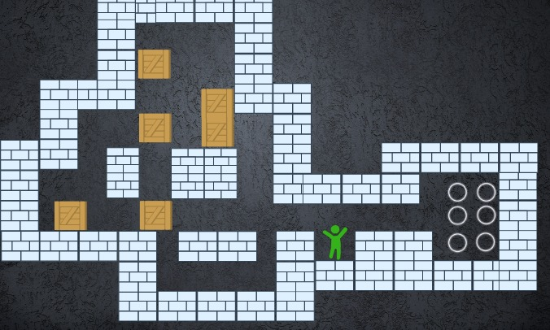
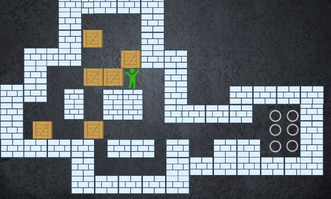
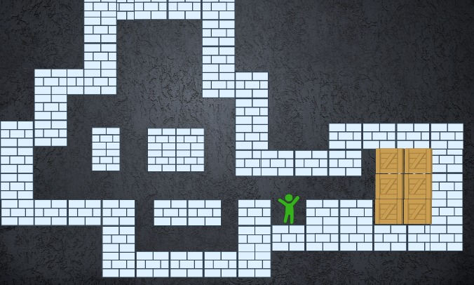
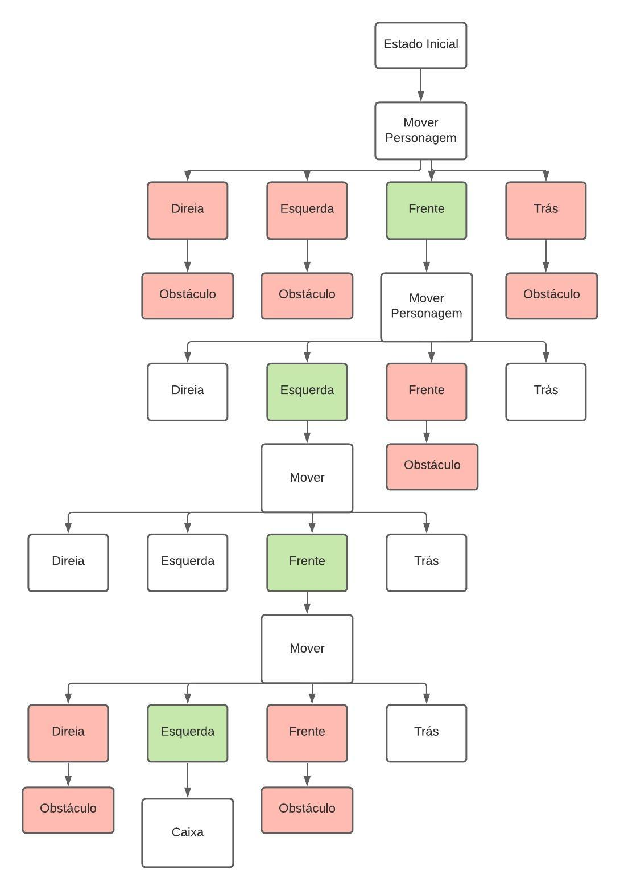
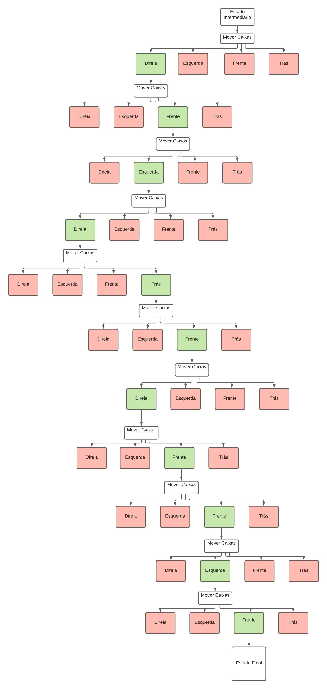

# Projeto IA
## Etapas:

### 1)
> Esboce uma representação visual (tela de jogo) para  cada um desses estados.

### Estado Inicial

---

---

### Estado Intermediario
---

---
### Estado Final

---

---

### 2)
> Utilizando grafos, represente o espaço de estados de seu jogo a partir de um estado inicial, indique todas as ações válidas para este primeiro estado, e também para seus filho, mas se restrinja a no máximo 10 vértices para este grafo.

---

---

> Repita a atividade, porém agora partindo de um estado objetivo qualquer, caminhando no sentido inverso das ações.

---

---

